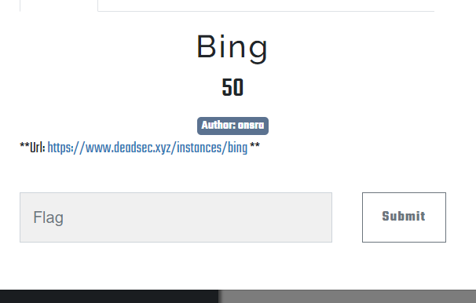
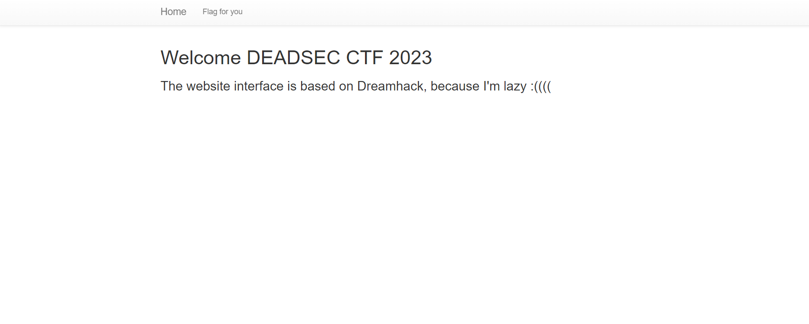
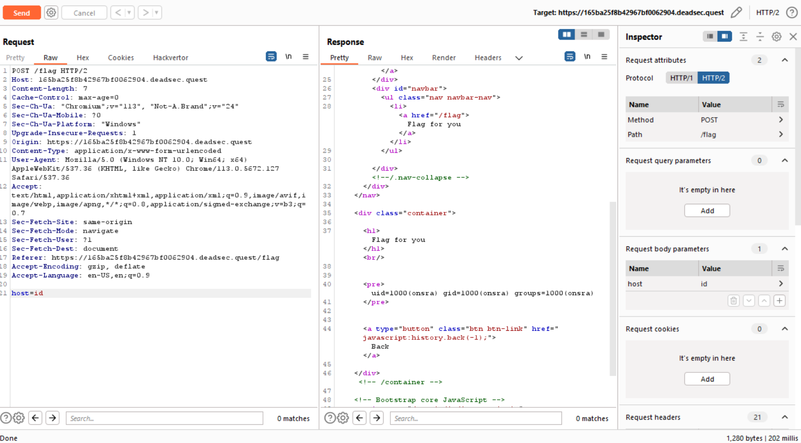
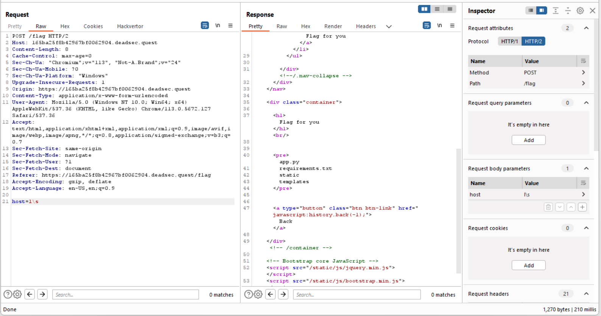
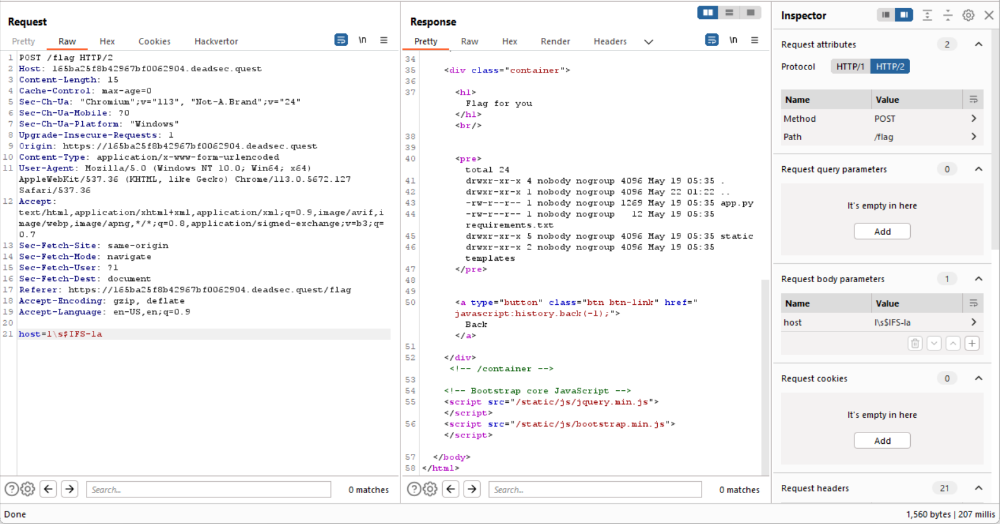
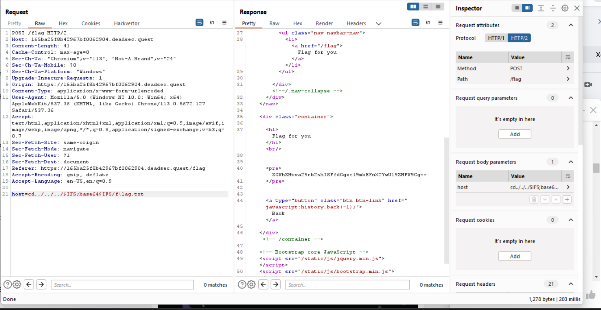
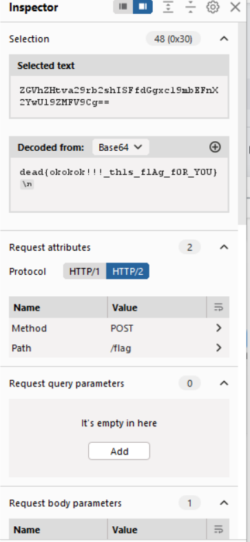

<<<<<<< HEAD
Challenge lấy đi não của mình là nó Bing :<

Vào web tác giả cung cấp thôi

Có vẻ là RCE rồi 

Tuy nhiên tác giả lại áp một cái filter chết tiệt làm challenge trở nên khó khăn hơn nó khiến ta chỉ nhập được kí tự và số mà thôi, à không chết tiệt hơn nữa là dường như ổng còn đặt thêm một số filter cho một số lệnh như ls, cat, ... 

Nhưng áp dụng một số trick ta vẫn có thể thực thi được RCE

Ok để xem flag ở đâu nào 

Không thấy flag :<, có vẻ nó được ẩn đi thì phải và sau một số lời nhờ vả thì mình cũng đã tìm ra cách moi được

Và boom ta đã có được flag

=======
Challenge lấy đi não của mình là nó Bing :<

Vào web tác giả cung cấp thôi

Có vẻ là RCE rồi 

Tuy nhiên tác giả lại áp một cái filter chết tiệt làm challenge trở nên khó khăn hơn nó khiến ta chỉ nhập được kí tự và số mà thôi, à không chết tiệt hơn nữa là dường như ổng còn đặt thêm một số filter cho một số lệnh như ls, cat, ... 

Nhưng áp dụng một số trick ta vẫn có thể thực thi được RCE

Ok để xem flag ở đâu nào 

Không thấy flag :<, có vẻ nó được ẩn đi thì phải và sau một số lời nhờ vả thì mình cũng đã tìm ra cách moi được

Và boom ta đã có được flag

>>>>>>> 403830ea7d8dcb3d3c2bb7b24248f2f460531f7f
