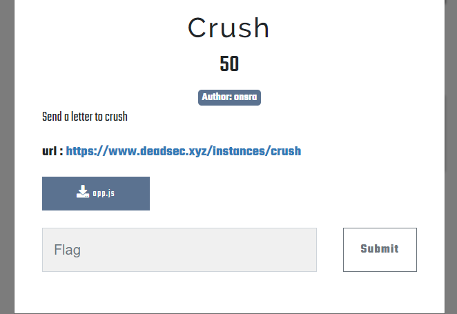
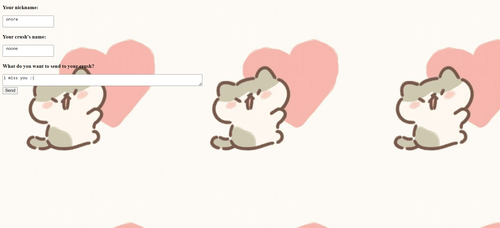
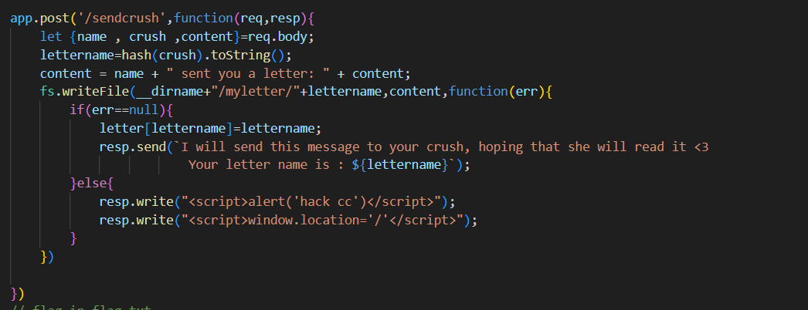
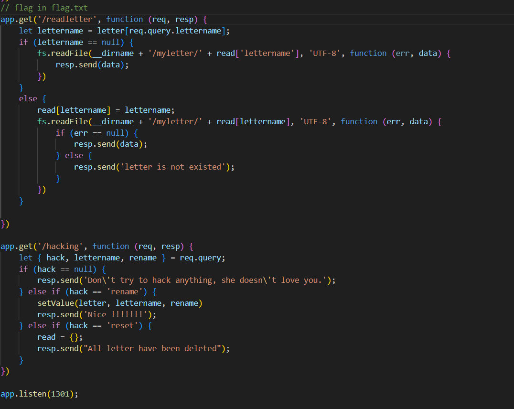
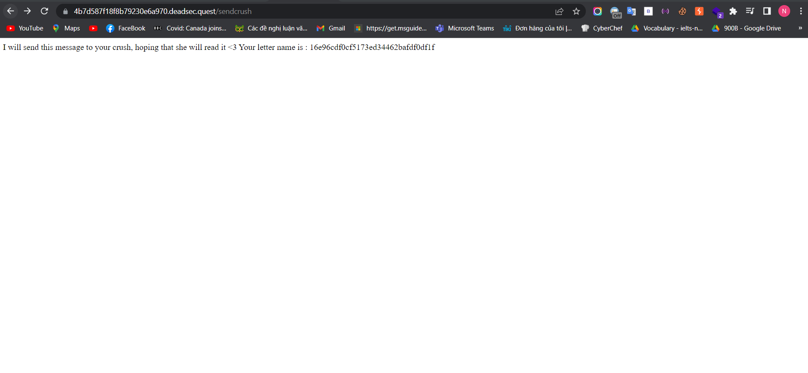
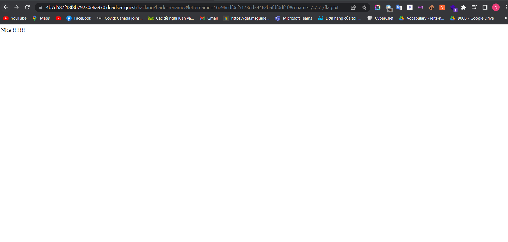
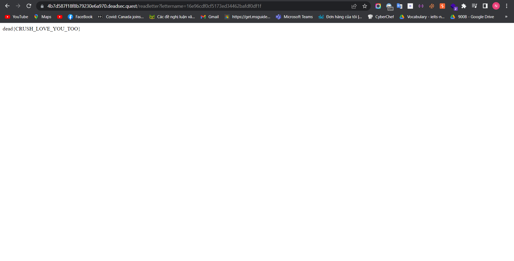

<<<<<<< HEAD
Challenge này mình giải gần hết thời gian nên là may mắn vẫn được :>

Ok vào challenge thôi nào :>

Send to crush :>>>>>>>, ok, đây là web chúng ta nhận được 

Có vẻ một form bình thường thôi ta vào source code tác giả cung cấp nào 

Ok nhìn source code tôi có ngay ý tưởng là liệu ta có thể ghi đè đường dẫn của flag.txt vào đường dẫn tới letter ta đã gửi cho crush hay không???
Loay hoay một lúc, à thực ra cũng không loay hoay lắm chỉ là mình không ở nhà lúc đang giải challenge này, rồi nghĩ cách khai thác trong đầu luôn về tới nhà thì nó vào tình cảnh như mình đã nó từ đầu. Ok, thử xem nó có hoạt đông không :>

Yeah có vẻ được rồi :>, lấy flag thôi 

=======
Challenge này mình giải gần hết thời gian nên là may mắn vẫn được :>

Ok vào challenge thôi nào :>

Send to crush :>>>>>>>, ok, đây là web chúng ta nhận được 

Có vẻ một form bình thường thôi ta vào source code tác giả cung cấp nào 

Ok nhìn source code tôi có ngay ý tưởng là liệu ta có thể ghi đè đường dẫn của flag.txt vào đường dẫn tới letter ta đã gửi cho crush hay không???
Loay hoay một lúc, à thực ra cũng không loay hoay lắm chỉ là mình không ở nhà lúc đang giải challenge này, rồi nghĩ cách khai thác trong đầu luôn về tới nhà thì nó vào tình cảnh như mình đã nó từ đầu. Ok, thử xem nó có hoạt đông không :>

Yeah có vẻ được rồi :>, lấy flag thôi 

>>>>>>> 403830ea7d8dcb3d3c2bb7b24248f2f460531f7f
