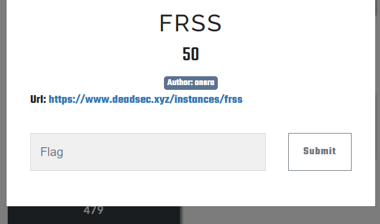
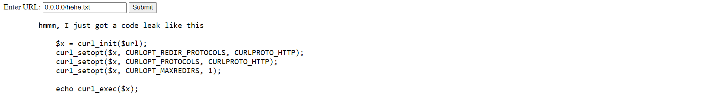
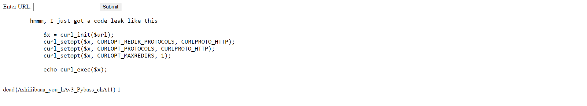

Challenge này mình giải rất vội nên là không lấy được một số test case để phân tích, được một bro nói là ssrf nên là mình thử vài payload like 127.0.0.1/hehe.txt, 10.10.10.10/hehe.txt đều không hiệu quả, và sau một lúc à không phải một lúc 30s trước khi challenge kết thúc thôi :< mình tìm được payload này 

và nó đã thành công lấy được flag

