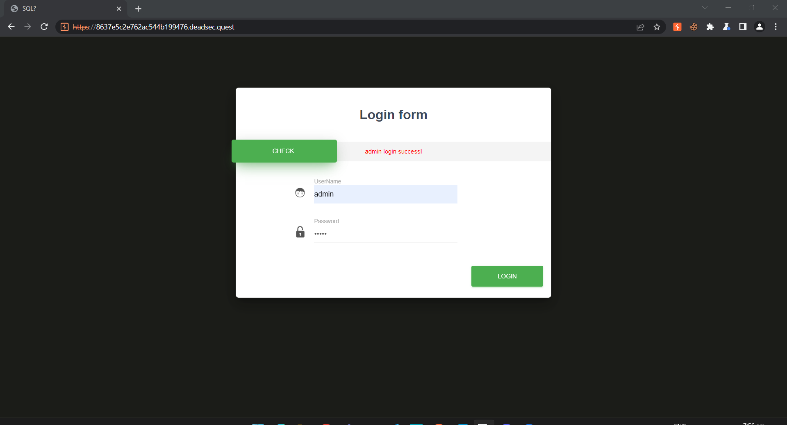
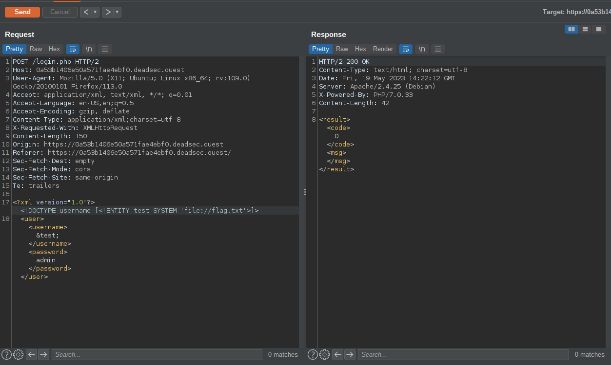
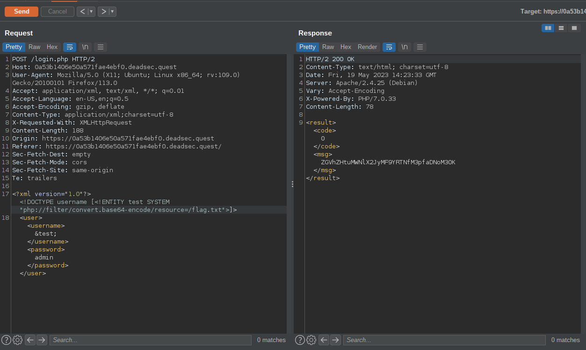

Vào web của challenge thôi nào, có vẻ giống như một form đăng nhập 

Thử đằng nhập bằng admin|admin và WOW đăng nhập thành công, ok thử vào burp suite xem nào. Vì challenge là XEE nên như mình đã nói từ đầu có vẻ là XXE nên mình thử basic payload xem nó có hoạt động không, và có vẻ là không :<

Hừm sau một hồi thử đi thử lại được vài gợi ý thì mình để ý có vẻ web này được viết bằng PHP nên khả năng phải bypass thông qua PHP filter. Yeah và cuối cùng mình cũng thành công 

